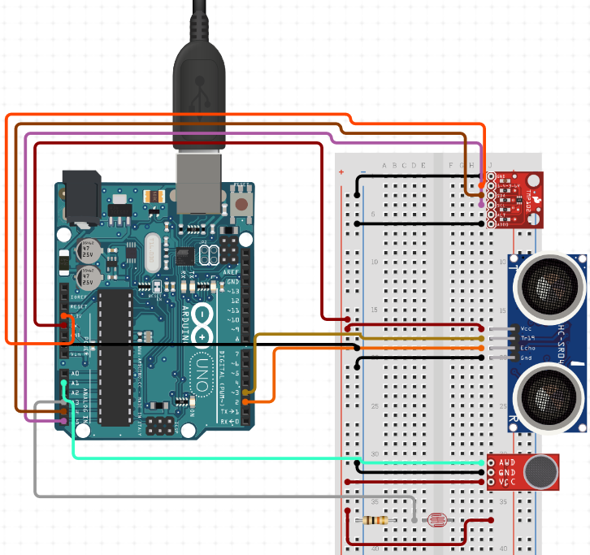
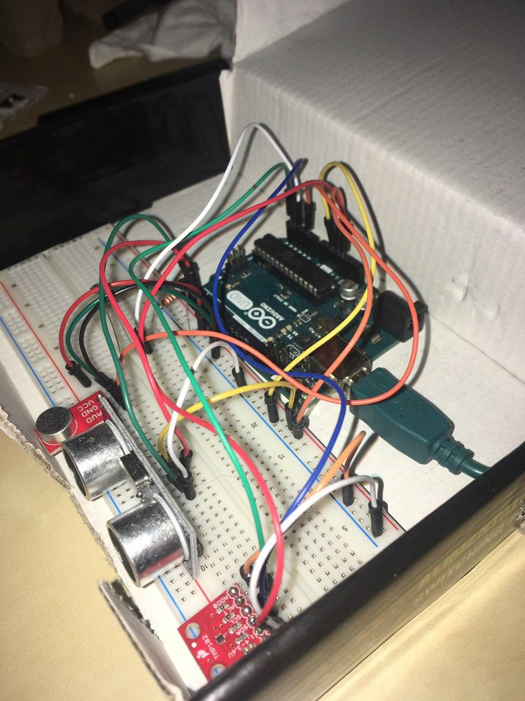
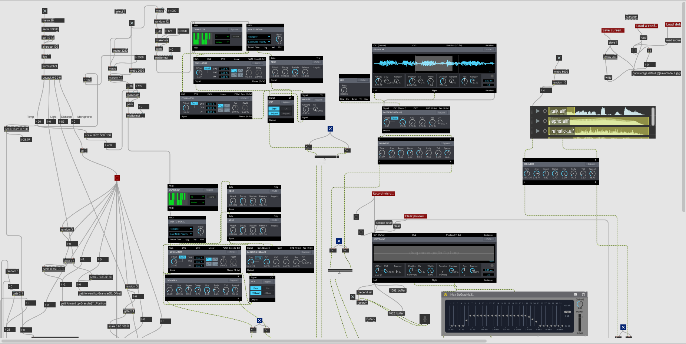
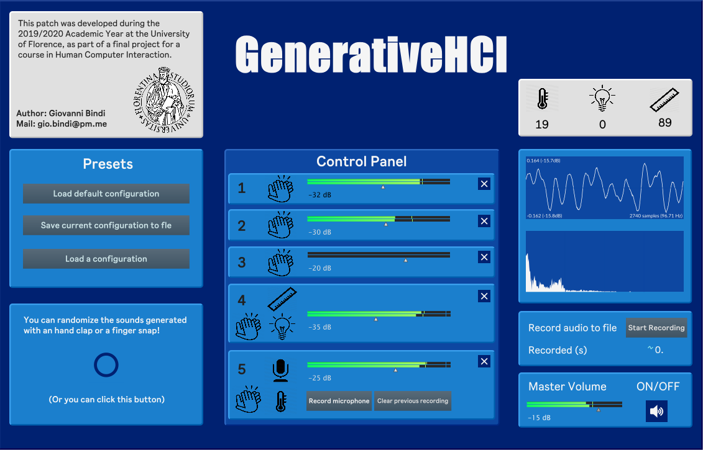

# Overview

- **Academic Year**: 2019-2020
- **Project Title**: GenerativeHCI
- **Students**: Giovanni Bindi 
- **CFUs**: 9

In this project I developed a simple hardware/software system able to produce [Generative Music](https://en.wikipedia.org/wiki/Generative_music). This was done exploiting the relationships with Human Computer Interaction and music production, trying to build a device that could be used by everyone. 

# Tools and Techniques

The device was built using an Arduino Uno board, paired with four sensors:

* A [SparkFun Digital Temperature Sensor](https://www.sparkfun.com/products/13314)
* A [Elecrow HC-SR04 Ultrasonic Sensor](https://www.elecrow.com/hcsr04-ultrasonic-ranging-sensor-p-316.html)
* A [SparkFun Electret Microphone](https://www.sparkfun.com/products/12758)
* A [Adafruit Light Dependant Resistor](https://www.adafruit.com/product/161)

these sensors provide measurements of the nearby environment, which are the core element of the music generation algorithm. 

This algorithm has been developed using the [Max/MSP](https://cycling74.com/products/max) programming language, along with a simple user interface, built with the embedded graphical objects in it.

# Expected Outcomes

- A simple yet usable system that could produce interesting music.
  
# Project Documents

Here is the [written report]().

